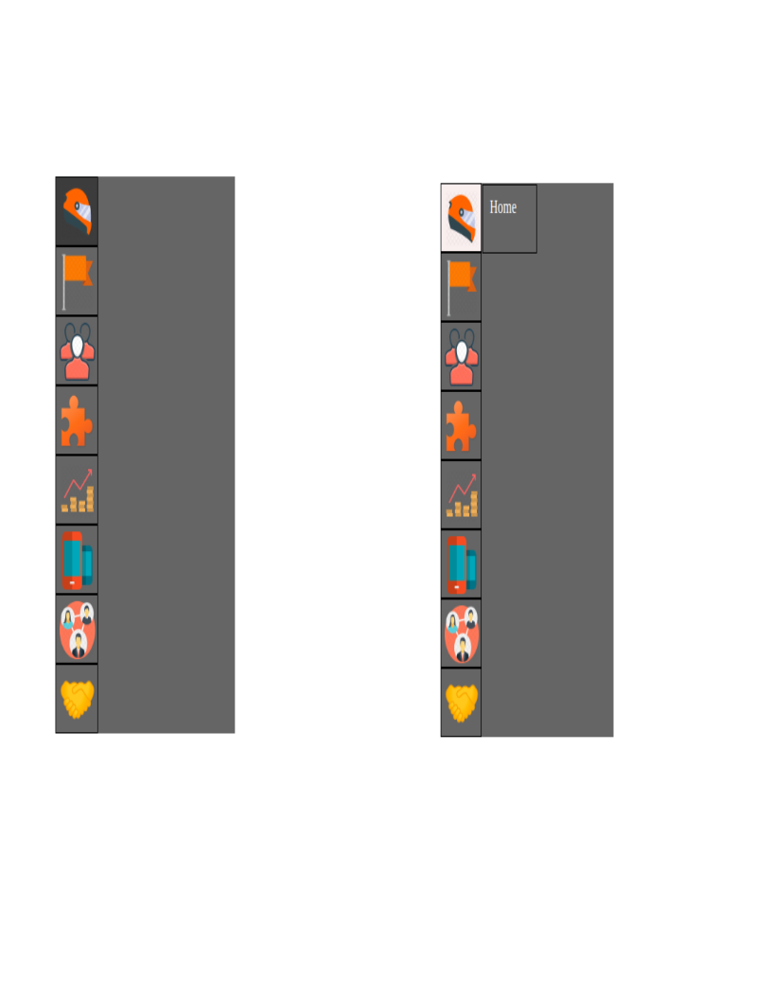

# Menu-anim-en-CSS# 

https://gregdicaro.github.io/Menu-anim-en-CSS/

Moi Greg j ai crée un projet pour des animations

c est une representation d'un menu deroulant avec un effet de transitio

j ai travaillé sur ce projet du 15 janvier au 17 janvier 

j etais en teletravail donc chez moi

ca ressemble un menu tout ce qu'il ya de normal mais stylé j avoue

le projet est terminé

il a ete fait en hmtl css et j ai utilisé animations

Problèmes rencontré :

1. Les images avec les positions absolues et les z-index.
2. Il me manquait un container pour le background rectangulaire.
3. Trouver la methode simple pour trouver des images transparentes sur google.

Les proprietes transition et transform ont ete utulisé pour ce projet .

ca vient d un exercice du coach Nico de chez becode

